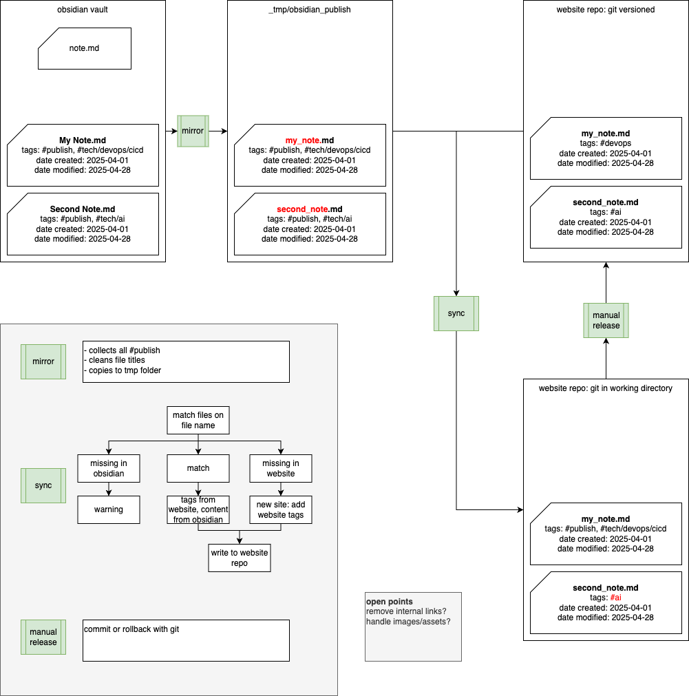

# Obsidian Sync

This project contains scripts to sync tagged notes from an Obsidian vault to a website repository.

## Usage

To execute the sync process, run

```bash
uv run mirror.py
```

## How it works

The `mirror.py` script performs the following steps:

1. **Mirroring**: It scans the Obsidian vault (configured in `mirror.py`) for markdown files containing the tag `tech/website/hosted`.
2. **Cleaning**: It cleans filenames to be web-compatible (lowercase, no spaces, etc.).
3. **Processing**: It extracts and copies images referenced in the notes to the website's assets folder and updates the links in the markdown content.
4. **Temporary Storage**: It saves the processed notes into a temporary folder (`_tmp/obsidian_publish`).
5. **Syncing**: It compares the temporary notes with the notes in the website repository and updates or adds them as needed.




## Configuration

Configuration constants `OBSIDIAN_VAULT_PATH`, `TARGET_TAG_VALUE`, and target paths for the website are defined at the top of `mirror.py`.
